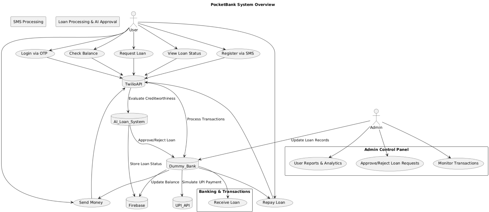

# 📱 PocketBank - SMS-Based Microfinance System

**PocketBank** is a secure **SMS-based microfinance platform** designed to provide banking and lending services to **unbanked communities**. This system enables users to perform **transactions, savings, and micro-loans** via **SMS**, using AI-powered credit scoring and dummy banking integration.

## 🚀 Live Demo
🔗 **[PocketBank Web Simulation](https://pocketbankiiitd.netlify.app/)**


### **UML Diagram**
Below is the **UML diagram** illustrating the system workflow.



---

## 📌 Features

✅ **SMS-Based Banking**
   - Register/Login via SMS
   - Check account balance
   - Transfer money via SMS
   - Request & repay loans

✅ **AI-Based Loan Approvals**
   - AI evaluates mobile transactions & spending patterns
   - Alternative credit scoring for underserved users

✅ **Dummy Banking System**
   - Manage user balance & transactions
   - Loan disbursement & repayment tracking

✅ **Admin Panel**
   - Loan request approval/rejection
   - Monitor transactions & fraud detection

✅ **UPI Payment Simulation**
   - Simulate payments via UPI APIs

---

## 🌜 System Architecture

---

## 🛠️ Tech Stack

| Component            | Technology Used |
|----------------------|----------------|
| **Frontend**        | React.js (for UI simulation) |
| **Backend**         | Firebase Realtime Database, Flask API |
| **SMS Handling**    | Twilio API |
| **Loan Processing** | AI-based rule engine (Python) |
| **Banking System**  | Dummy banking integration |
| **UPI Simulation**  | Razorpay API |
| **Hosting**         | Vercel / Firebase Hosting |

---

## 🛠️ Installation Guide

Follow these steps to **run the project locally**:

### **1️⃣ Clone the Repository**
```bash
git clone https://github.com/yourusername/PocketBank.git
cd PocketBank
```

### **2️⃣ Install Dependencies**
```bash
npm install  # Install frontend dependencies
cd backend
pip install -r requirements.txt  # Install backend dependencies
```

### **3️⃣ Setup Environment Variables**
Create a `.env` file in both **frontend** and **backend** directories.

#### **Frontend `.env`**
```
REACT_APP_TWILIO_API_KEY=your_twilio_key
REACT_APP_FIREBASE_API_KEY=your_firebase_key
REACT_APP_UPI_API_KEY=your_upi_key
```

#### **Backend `.env`**
```
TWILIO_ACCOUNT_SID=your_twilio_sid
TWILIO_AUTH_TOKEN=your_twilio_auth_token
FIREBASE_DATABASE_URL=your_firebase_url
```

### **4️⃣ Run the Project**

#### **Frontend**
```bash
npm start
```

#### **Backend**
```bash
cd backend
python app.py
```

Now, open **http://localhost:3000** in your browser.

---

## 💡 Usage Guide

### **User Commands via SMS**
| Command | Function |
|---------|----------|
| `JOIN POCKETBANK` | Register a new account |
| `BALANCE` | Check current balance |
| `LOAN 500` | Request ₹500 loan |
| `SEND 100 TO 9876543210` | Send ₹100 to another user |
| `PAY 50` | Repay ₹50 of the loan |

---

## 🛡️ Security & Fraud Prevention

🔐 **Multi-Layered Security**:
- **OTP Verification** via Twilio
- **AI-Based Loan Risk Analysis** to prevent fraud
- **Data Encryption** for SMS transactions

⚠️ **Fraud Mitigation Strategies**:
- Loan limits for **new users** (₹500 max initially)
- **Community-based lending** (users need referrals)
- **Admin monitoring** of unusual activities

---

## 🗓 Development Roadmap

✅ **Phase 1** - Mobile UI & SMS Simulation *(Completed)*
✅ **Phase 2** - AI Loan Approval & Admin Panel *(Completed)*
🚧 **Phase 3** - UPI Simulation & Final Testing *(In Progress)*

---

## 💡 Future Expansion

🔹 **UPI Integration** with real banks  
🔹 **AI Financial Advisor** for savings guidance  
🔹 **Rural Micro-Investments** for community growth  
🔹 **Government Financial Inclusion Partnerships**  

---

## 📢 Contributing

We welcome contributions! Follow these steps:

1. **Fork the Repository**
2. **Create a Feature Branch** (`git checkout -b feature-new`)
3. **Commit Changes** (`git commit -m "Added new feature"`)
4. **Push to GitHub** (`git push origin feature-new`)
5. **Submit a Pull Request**

---

## 🏆 Credits

👨‍💻 **Developed by**: **Abhigyann Raj**  

---

## 📚 License

This project is licensed under the **MIT License**.

---

## 🌟 Support & Feedback

If you found this useful, **⭐️ star the repo** and provide feedback! 🚀
